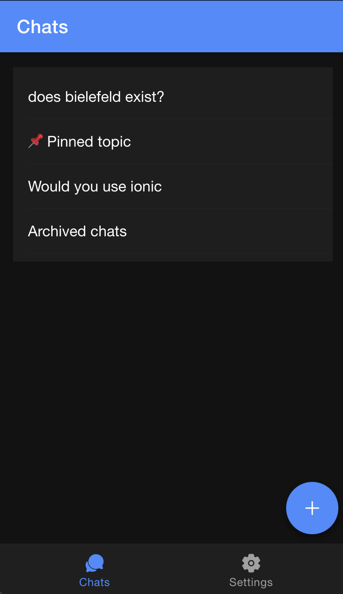

# Webxdc starter chat example with Iconic Framework and Stencil



## limitations:

- use `src` attribute instead of name for icons, because using the `name` attribute would include all icons in the build
   - (and we manually exlude them from the xdc because of that right now in `./create-webxdc.sh`)

- dedicated webxdc-dev tool does not work in github codespaces, because it relies on multiple ports

## run with the simple simulator:

```bash
npm start
```

## run with webxdc dev tool:
```
// TODO
```

## To build the webxdc for production, run:

```bash
npm run build
```

## To run the unit tests once, run:

```
npm test
```

## To run the unit tests and watch for file changes during development, run:

```
npm run test.watch
```
